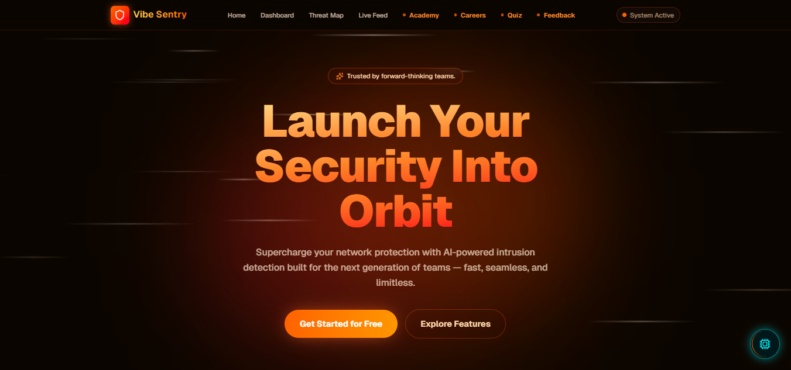
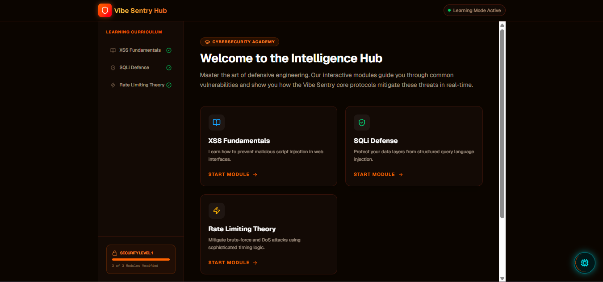
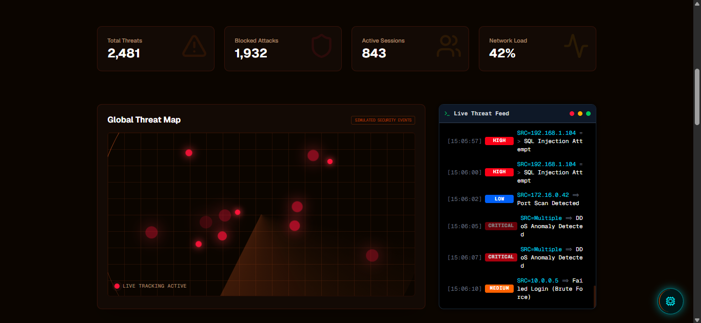

# 🔥 Vibe Sentry: Cyber Learning Hub & IDS Dashboard

Vibe Sentry is a state-of-the-art **Intrusion Detection System (IDS)** dashboard and **Cybersecurity Academy**, designed for the modern security professional. It combines high-fidelity visual telemetry with an interactive educational curriculum, all wrapped in a premium "Fiery/Smoky" aesthetic.

## 🖼️ Visual Previews

### 1. Command Center (Landing)


### 2. Intelligence Hub (Academy)


### 3. Real-Time SOC Dashboard


## 🎨 Design Philosophy
- **"Fiery/Smoky" UI**: Built from intent, not a template. Deep oranges, charcoal blacks, and glassmorphic elements create an immersive, high-stakes operational environment.
- **Dynamic Interaction**: Every element is alive, from the holographic map blips to the terminal-style scrolling logs.

## 🚀 Key Features

### 📡 Defensive Telemetry
- **Holographic Threat Map**: A real-time geospatial map featuring radar sweeps and live "threat blips" simulating global security events.
- **Terminal-Style Live Feed**: High-performance scrolling logs with color-coded severity (Critical → High → Medium → Low).
- **Enterprise Security**: Production-ready from day one with Rate Limiting, XSS Sanitization, and hardened security headers (CSP, HSTS).

### 🎓 Cyber Academy
- **Interactive Modules**: Hands-on lessons on **XSS Fundamentals**, **SQLi Defense**, and **Rate Limiting Theory**.
- **Defense Code Integration**: Each module showcases actual production code snippets used in the platform's defense layers.
- **Axiom-Sensei AI Mentor**: A Gemini-powered Senior Security Architect that evaluates technical accuracy, provides career roadmaps, and offers "Sensei Insights" during assessments.
- **Analyst Certification**: A dedicated quiz engine to validate mastery of the curriculum.

### 🏆 Gamification & Feedback
- **Session Leaderboard**: Track technical mastery scores for the current session.
- **Live Intelligence Ingestion**: A feedback terminal that pipes student reports directly into the live SOC telemetry feed via `BroadcastChannel` API.

## 🛠️ Tech Stack
- **Core**: Next.js 16 + React 19
- **Styling**: Tailwind CSS v4 (Fiery/Smoky Custom Design System)
- **Animations**: Framer Motion
- **AI Engine**: Google Gemini Pro (Axiom-Sensei Core)
- **Deployment**: Google Cloud Run via Docker (Standalone Output)
- **State**: React Local State + LocalStorage (Zero Database Requirement)

## ☁️ Cloud Architecture
The app is optimized for **Always-On Cloud Deployment** on Google Cloud Run. By utilizing `min-instances: 1`, we ensure zero cold starts, providing a seamless, real-time experience for security analysts worldwide.

## 💻 Getting Started

1. **Clone the repo:**
   ```bash
   git clone https://github.com/sayuj5/vibe-sentry.git
   cd vibe-sentry
   ```

2. **Install dependencies:**
   ```bash
   npm install
   ```

3. **Configure Environment:**
   Create a `.env.local` file:
   ```env
   GOOGLE_GENERATIVE_AI_API_KEY=your_gemini_api_key_here
   ```

4. **Run the Development Server:**
   ```bash
   npm run dev
   ```

5. **Build for Production:**
   ```bash
   npm run build
   npm start
   ```

## 🔒 Security Notice
This dashboard is a simulation intended for educational purposes. While the security middleware (Rate Limiting, Sanitization) is production-ready, always conduct a full security audit before deploying to critical enterprise environments.

---
*Built with intent by Sayuj.*
